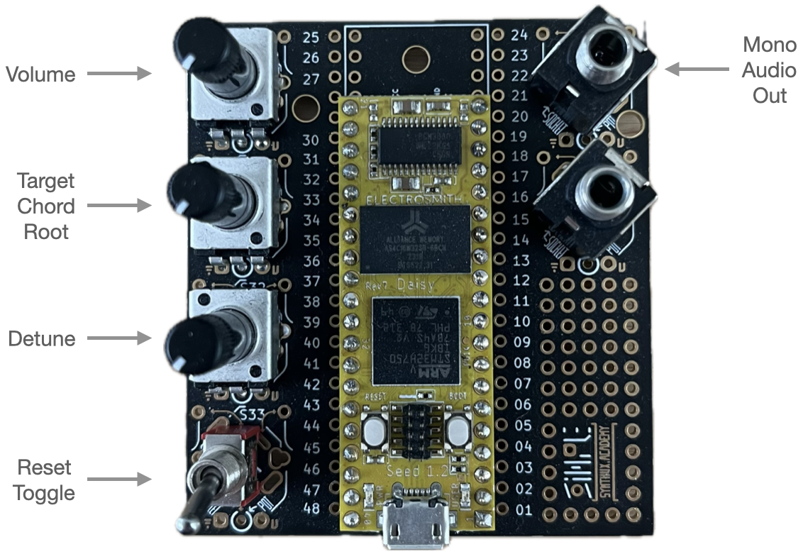

# deepnote

A Daisy Seed synth voice using [deepnote](https://github.com/davidirvine/deepnote)

This repo uses CMake external pojects to manage external dependencies. These external repos will be cloned and built on your first build. For build and device programming info see [daisy-seed-vscode-template](https://github.com/davidirvine/daisyseed-vscode-template).

## Overview

I used the Synthux [Simple Fix](https://www.synthux.academy/simple-synth/fix) as a hardware platform. It's nice since it includes a Daisy Seed and a few pots and switches. Here's how I have it configured:

Control values are read via ADC channels in the main loop. A set of global state variables are updated in the main loop, and read from to update subvoice parameters in the audio callback. 

The complete voice is comprised of 5 "duo" subvoices and 4 "trio" subvoices. Each duo subvoice has 2 oscillators and each trio subvoice has 3 oscillators. Subvoice oscillators can be detuned.

`Volume` - simple volume control where full CCW is off and full CW is max volume. Raw control values are linearly mapped to the range 0.f to 1.f. 

`Target Chord Root` - sets the root note of the target chord. Really you're changing the row index in the frequency table. Knob rotation is divided into 12 evenly spaced indexes from 1 to 12. One for each note in the chromatic scale starting with 1 = C. See _Target Chords and Frequency Table_ below.

`Detune` - sets the amount of detune (Hz) between the oscillators in a two or three ocscillator "sub-voice". Raw control values are linearly mapped to the range 0.f to 5.f.

`Reset Toggle` - every time you togle the switch from one position to the other that start frequency of all sub-voices is reset to a random frequency between 200Hz and 400Hz.

`Mono Audio Out` - yep, mono only

## Target Chords and Frequency Table

The frequency each subvoice should be targeting at any point in time is obtained via frequency table lookup. Conceptually the frequency table is a 2D array of frequencies. There is a column for each subvoice, and a row for each chord the voice can play. The values in the frequency table were computed using `tools/freqtable-builder.py`. It takes a primative chord description and generates output containing the frequency per note (one note per column or subvoice) in the chord transposed to all 12 keys (one chord per row).
